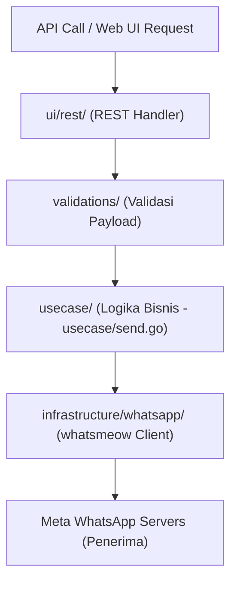

# Panduan Pengembang: Arsitektur & Pengembangan engine_goWA

Panduan ini dirancang untuk membantu Anda memahami struktur kode, arsitektur, dan cara mengembangkan fitur pada **`engine_goWA`** (WhatsApp Multi-Device Engine) Anda yang kini terintegrasi secara modular dengan `masanas_wa_gateway`.

---

## 1. Struktur Direktori Proyek (`engine_goWA/src`)

Berikut adalah peta folder utama di dalam `engine_goWA/src/` beserta kegunaannya:

```text
src/
├── cmd/             <-- Perintah CLI (Cobra) & Booting Server (rest.go, root.go)
├── config/          <-- Variabel konfigurasi global WhatsApp & aplikasi
├── domains/         <-- Definisi kontrak interface & model data bisnis
├── infrastructure/  <-- Integrasi pihak ketiga: WhatsApp (whatsmeow), Chat Storage
├── pkg/             <-- Utilitas umum: database SQLite helper, logger, validasi
├── ui/              <-- Lapisan Handler (REST HTTP Controller & WebSocket Hub)
├── usecase/         <-- Logika bisnis inti (proses kirim pesan, autoreply, dll.)
├── validations/     <-- Logika validasi data request sebelum diproses
└── views/           <-- Dashboard Web UI (HTML, CSS, JS, & komponen visual)
```

---

## 2. Aliran Arsitektur Pengiriman Pesan (Data Flow)

Setiap kali backend utama atau pengguna luar memanggil API pengiriman pesan WhatsApp, aliran data di dalam `engine_goWA` adalah sebagai berikut:



---

## 3. Di Mana Saya Harus Mengubah Kode? (Panduan Kustomisasi)

### A. Jika Ingin Menambahkan Fitur Pengiriman Baru (Misal: Kirim Dokumen PDF)
Untuk menambahkan tipe pesan baru, Anda perlu memperbarui lapisan berikut secara berurutan:
1. **`domains/send.go`**: Definisikan kontrak fungsi baru Anda (misal `SendDocument(...)`).
2. **`usecase/send.go`**: Implementasikan logika pengiriman dokumen menggunakan koneksi `whatsmeow` lokal (membangun struktur message signal whatsmeow).
3. **`ui/rest/send.go`**: Buat rute HTTP baru di Fiber (misalnya `POST /send/document`) untuk menangkap payload request dan meneruskannya ke usecase.

### B. Jika Ingin Memodifikasi Tampilan Dashboard WhatsApp Engine (`localhost:4040`)
Tampilan dashboard web UI bawaan diletakkan di bawah folder **`views/`**:
* **`views/index.html`**: Halaman utama dashboard web (tempat me-render scan QR Code dan status koneksi perangkat).
* **`views/components/`**: Berkas HTML modular (misal kartu status, form kirim pesan).
* **`views/assets/`**: Gambar, CSS, dan skrip Javascript penunjang.

*Catatan: Setelah memodifikasi bagian visual ini, Anda hanya perlu melakukan build ulang di backend utama Anda agar aset baru ter-embed secara dinamis.*

### C. Mengelola Penyimpanan Sesi WhatsApp (Database SQLite)
Engine menyimpan seluruh sesi enkripsi WhatsApp di bawah direktori **`src/storages/`**:
* **`whatsapp.db`**: Menyimpan kunci sesi QR Code whatsmeow (jika berkas ini dihapus, Anda harus scan ulang QR Code WhatsApp Anda).
* **`chatstorage.db`**: Menyimpan histori chat dan pesan masuk lokal untuk kebutuhan auto-reply/webhook.

---

## 4. Mekanisme Embedding Aset yang Aman

Karena engine ini diimpor oleh backend utama, kami telah mendesain mekanisme embedding yang aman dari batasan compiler Go (`//go:embed`):
* Berkas **`src/views/views.go`** bertindak sebagai penyimpan aset statis yang dideklarasikan secara lokal.
* Berkas **`src/cmd/rest.go`** mendefinisikan `customFileSystem` wrapper yang secara otomatis memotong path `/views/` di balik layar agar Fiber dapat menemukan berkas template tanpa error *template does not exist*.

Anda tidak perlu khawatir tentang error embedding ini saat memodifikasi berkas HTML/CSS di dalam folder `views/`.

---

## 5. Menguji engine_goWA Secara Mandiri (Standalone Mode)

Meskipun sudah diintegrasikan sebagai package, Anda tetap bisa menjalankan `engine_goWA` secara terpisah (seperti dulu) untuk kebutuhan pengujian unit test atau isolasi bug:

1. Buka terminal di folder **`engine_goWA/src`**.
2. Jalankan server secara standalone menggunakan perintah:
   ```bash
   go run main.go rest
   ```
3. Server standalone akan aktif di port yang tertera pada `.env` folder `engine_goWA` tersebut.
